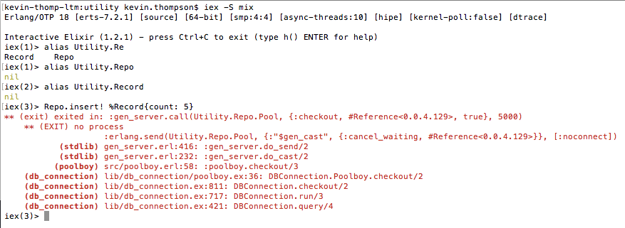
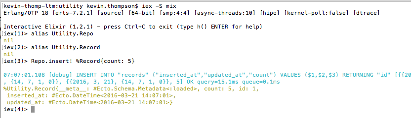

# Todo

* add a link to the elixir-lang slack group into the blog post right after the
Repo error message
* add photo of error message to img/ and fix the place where it says to put that picture
* add photo of working Repo and fix the place where it says to put that picture.

# When Phoenix is Overkill
Elixir, Plug, and Ecto on Heroku

Have you ever found yourself in a situation where you started developing a
really simple utility but you kept adding functionality until it grew into
something far bigger than what you intended?  Or that you needed to add some
functionality that you hadn’t anticipated in the beginning and now you’re not
sure where to start? Pretty much every sinatra app I develop eventually becomes
a crappy, less-functional Rails app. That’s why when I develop web apps in
Elixir I always use the Phoenix Framework. However, I recently developed a
simple utility in Elixir for auditing membership in our GitHub organization, and
only later realized that I needed it to have database connectivity and a web
endpoint so that I could monitor the status. Now what? I didn’t want to spin up
a new Phoenix project and copy my code into it. Especially since all I wanted
was to be able to do a GET request and find out the last time the utility ran. I
needed to add something more lightweight to my existing code.

# First, the utility

Let’s get to where I was when I decided I wanted to add database and web. I’m
not going to go through everything for auditing GitHub, though, we’re going to
keep it simple. Start by creating the project with a supervisor.

`mix new utility --sup`

Add in `httpotion` and `poison` to the dependencies in `mix.exs`. `httpotion` is what
we'll use to grab JSON data from a web server, and `poison` is what we'll use to
parse the JSON.

```
defp deps do
    [
      {:httpotion, "~> 2.1.0"},
      {:ibrowse, github: "cmullaparthi/ibrowse", tag: "v4.1.2"},
      {:poison, "~> 1.5"}
    ]
  end
```

You’ll need to add `:httpotion` to the applications list in `mix.exs` as well. Now
grab your dependencies:

`mix deps.get`

Finally, make a file named `lib/users.ex` and add this to it. Now you have a
simple utility to count the number of users that get returned by the JSON
placeholder service.

```
defmodule Users do
  def main do
    response = HTTPotion.get "http://jsonplaceholder.typicode.com/users"

    case Poison.Parser.parse(response.body) do
      {:ok, json} -> IO.puts "I got #{length(json)} users!"
      _ -> IO.puts "something wrong with the answer"
    end
  end
end
```

Test it out if you want, just run `iex -S mix` and then run `Users.main` and you
should get a success message. If you get an error message double check that you
remembered to put `:httpotion` in the applications list in `mix.exs` (right behind
:logger). This is similar to what I originally created. I set it up to run every
day and I had also included some code to mail messages out if the findings were
not good. But when everything is going well, you start to wonder if your utility
is actually running every day.

# Adding the database

Let’s have the utility write to a database every time it runs. That way we can
see when it last ran and how many results it found. Start by adding `ecto` and
`postgrex` to our dependencies in `mix.exs`. Don’t forget to run `mix deps.get`
afterwards.

```
def application do
    [applications: [:logger, :httpotion, :postgrex, :ecto],
     mod: {Utility, []}]
  end

defp deps do
    [
      {:httpotion, "~> 2.1.0"},
      {:ibrowse, github: "cmullaparthi/ibrowse", tag: "v4.1.2"},
      {:poison, "~> 1.5"},
      {:postgrex, ">= 0.0.0"},
      {:ecto, "~> 2.0.0-beta"}
    ]
  end
```

Next we need a module for our Repo and a schema for our records. Create a file
called `lib/repo.ex` and fill it in.

```
defmodule Utility.Repo do
  use Ecto.Repo, otp_app: :utility
end
```

And a file named `lib/record.ex` and fill that in. We’re just going to add a
single field for the count of user records that come back and the timestamps
will keep track of when it was last run.

```
defmodule Utility.Record do
  use Ecto.Schema

  schema "records" do
    field :count, :integer

    timestamps
  end
end
```

We need to configure some settings so Ecto knows how to connect to the database.
Add this into your `config/config.exs` file.

```
config :utility, Utility.Repo,
  adapter: Ecto.Adapters.Postgres,
    url: System.get_env("DATABASE_URL") || "postgres://localhost/utility_dev",
    pool_size: 5
```

> Let's read that for a second. config basically creates a key:value pair that
applications can query. In this case we're telling config to add a key:value
pair to an application called :utility. The key in this case is Utility.Repo and
the value is a keyword list [url: some_string, pool_size: 5]. For the database
connection string we're telling Elixir to grab that from the computer's environment
variables, but if that key should not exist for some reason, then user
postgres://localhost/utility_dev. If you want to see this in action run
`iex -S mix` and then run `Application.get_env(:utility, Utility.Repo)`

We’re using `DATABASE_URL` for the environment variable name because that is what
Heroku Postgres will expose to our application at runtime. Now we can create a
database migration and we’ll be ready to go. Run mix `ecto.gen.migration
create_records` and add this to the migration file that gets created.

```
def change do
    create table(:records) do
      add :count, :integer

      timestamps
    end
  end
```

Now you should be able to create your database. Run these commands:

```
mix ecto.create
mix ecto.migrate
```

> Later on we will run these commands on Heroku, but we wont run
`mix ecto.create`. Heroku will have already created the database and you
wont have permission to create new databases. So all we have to do is run the
migration

We’re almost there, but I ran into some problems when I tried to run `iex -S mix`:


It turns out that Ecto expects your Repo to be supervised. I didn’t know that
and it took a push from the fine people at elixir-lang to help me through it.
Luckily, it’s an easy fix if you created your app with the --sup option and you
know that's what you’re supposed to do. Go to `lib/utility.ex` and add your Repo to the
children that your supervisor will supervise.

```
children = [
      # Define workers and child supervisors to be supervised
      # worker(Utility.Worker, [arg1, arg2, arg3]),
      worker(Utility.Repo, [])
    ]
```


Awesome! Our database connection is working. Let’s add a line to our utility so
that every time we run it the number of users gets recorded in the database.
Head over to `lib/users.ex` and make it look like this:

```
defmodule Users do
  alias Utility.Repo
  alias Utility.Record

  def main do
    response = HTTPotion.get "http://jsonplaceholder.typicode.com/users"

    case Poison.Parser.parse(response.body) do
      {:ok, json} -> IO.puts "I got #{length(json)} users!"
        Repo.insert! %Record{count: length(json)}
      _ -> IO.puts "something wrong with the answer"
    end
  end
end
```

> Here I'm aliasing Utility.Repo and Utility.Record so that I don't have to
type that whole string out. It would be fine to leave them out, but then I
would have to type Utility.Repo.insert! %Utility.Record{count: length(json)}.
I'm using Poison to parse the JSON response that we get back from the server.
I wrapped that in a case statement so that if the JSON parses properly and Poison
returns :ok then I'll pattern match the json into the variable `json`. If I get
any other answer, then I can send an error message to standard output.

# Web status

I don't want to open up a postgres shell every time I want to know how my
database  is running. I want to be able to open a browser, visit a site, and
find out when was the last time my utility ran and how many users did it find.
For something like this, Phoenix is just way too much. Instead, we’ll just use
Plug. Be warned though, we’re starting on the dangerous path to turning our
application into a crappy, less-functional Phoenix app just like I do with all
my Sinatra projects. Let’s start by adding our requirements (`cowboy` and `plug`) to
`mix.exs` and run `mix deps.get`.

```
defp deps do
    [
      {:httpotion, "~> 2.1.0"},
      {:ibrowse, github: "cmullaparthi/ibrowse", tag: "v4.1.2"},
      {:poison, "~> 1.5"},
      {:postgrex, ">= 0.0.0"},
      {:ecto, "~> 2.0.0-beta"},
      {:poison, "~> 1.5"},
      {:cowboy, "~> 1.0.0"},
      {:plug, "~> 1.0"}
    ]
  end
```

Now we can create a file for our routes. This is actually pretty similar to
Sinatra. I created a file called `lib/status.ex` and filled it in like this.

```
defmodule Status do
  use Plug.Router
  alias Utility.Repo
  alias Utility.Record
  import Plug.Conn

  plug :match
  plug :dispatch

  get "/status" do
    last_run = Record |> Ecto.Query.last |> Repo.one

    conn
    |> put_resp_content_type("application/json")
    |> send_resp(200, Poison.encode!(%{last_run: last_run.inserted_at, result_count: last_run.count}))
  end

  match _ do
    conn
    |> send_resp(404, Poison.encode!(%{endpoint: "not implemented"}))
  end

end
```

So here we’re using `Plug.Router`, as well as `match` and `dispatch` so that we
can define routes in this file. I also aliased my Repo and Record again and
imported `Plug.Conn` so that I don’t have to be so verbose. Then I defined a
`GET` route for `/status`, which calls the most recent entry in the database,
and returns a JSON representation of the time the utility was run and how many
records were found.

At this point our app should be functional. If you open up `iex -S mix` you can
start running your server by typing `Plug.Adapters.Cowboy.http Status, []`. Then
point your browser at `http://localhost:4000/status` and you should see some JSON.
Unless you haven't run the utility and written anything to the database. Well that's
cool and all, but I don't want to open `iex` every time I run my server. So let's
make it run more automatically.

To do that, we need to put our Plug router stuff under supervision like we did
with our Repo. Let's go into `lib/utility.ex` and add our `Status` as a worker.
Don't forget to put a comma after the other worker in the list.

```
children = [
  # Define workers and child supervisors to be supervised
  # worker(Utility.Worker, [arg1, arg2, arg3]),
  worker(Utility.Repo, []),
  worker(Status, [])
]
```

When we start our application, the supervisor is going to try to start `Status`,
but that will fail because we don't have the expected functions in our `Status`
module. We need to add an `init` and `start_link` function. Open up `lib/status.ex`
and add these two functions.

```
def init(options) do
  options
end

def start_link do
  {:ok, _} = Plug.Adapters.Cowboy.http Status, []
end
```

Now if you open `iex -S mix` your web server starts automatically without you
having to type any other commands. Even cooler, you don't have to open `iex` at
all. You can just run `mix run --no-halt` and your web server will start up and
accept connections.

# Deploying to Heroku

There are a few other tweaks we need to make to run this on Heroku. Right now
our web service is always going to run on port 4000. Heroku wont let you just
connect to whatever port you feel like, though, it will tell your app what port
it can use. So let's configure our web server to get its port information from
an environment variable. Do you remember what file we go to for configuration
settings? `/config/config.exs`. Add this line to your configuration.

`config :utility, web_port: String.to_integer(System.get_env("PORT") || "4000")`

> We're setting another key:value pair like we did before with this file. The
tricky thing here is the integer conversion. Heroku exposes the port as an integer,
which is what we want. But `System.get_env` unhelpfully turns that back into a string.
Cowboy will choke if we send it a string. And `System.get_env` will return nil if
that environment variable isn't present. So we use our double pipe to make sure
that we either get a string from `System.get_env` or we get the string "4000" and then
we wrap all of that in `String.to_integer` to make sure that our finished value is
acceptable to Cowboy.
